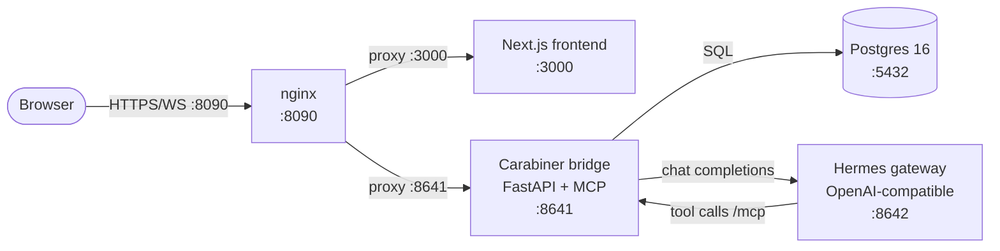

# CarabinerOS

CarabinerOS — prep-to-order correlation for restaurant ops.

## What it is

CarabinerOS is an AI general manager for independent restaurants. It watches your prep, inventory, and orders in one place, then drafts the next move — restock the walk-in, cut tonight's prep list, flag a slow line item — and asks before it commits anything. The intelligence layer is exposed as MCP tools, so the same prep, inventory, and orders data can drive a chat, a nightly report, or a third-party system without re-implementing the data model. It runs as a single self-hosted stack on one host, with one Postgres, one bridge, one model gateway, and one web UI.

## Demo

Live demo runbook: [docs/HERMES_BETA_RUNBOOK.md](docs/HERMES_BETA_RUNBOOK.md).

The Cloudflare tunnel is currently DOWN. Access is via SSH tunnel:

```bash
ssh -L 8090:127.0.0.1:8090 hermes-vps
```

Then open [http://localhost:8090](http://localhost:8090) in your browser.

## Architecture



The bridge owns the frontend contract, the policy layer, the audit log, and the MCP surface. Hermes is bundled as a pinned gateway and is not exposed to the browser directly.

## Stack

| Layer        | Technology                                       |
|--------------|--------------------------------------------------|
| Frontend     | Next.js 16, React 19                             |
| Styling      | Tailwind CSS 4                                   |
| Bridge / API | FastAPI (Python) + python-socketio               |
| Intelligence | Hermes (`hermes-agent`) — OpenAI-compatible gateway on `:8642` |
| MCP surface  | FastMCP `streamable-http` at `/mcp`              |
| Database     | PostgreSQL 16, SQLAlchemy 2.0 async, asyncpg     |
| Reverse proxy| nginx                                            |
| Orchestration| Docker Compose (`docker-compose.hermes.yml`)      |

## Local dev

```bash
docker compose -f docker-compose.hermes.yml up --build -d
```

Then open [http://localhost:8090](http://localhost:8090).

The compose file brings up Postgres on `:5432`, the bridge on `:8641`, Hermes on `:8642`, the Next.js frontend on `:3000`, and nginx on `:8090` as the public entry point.

## Repo layout

```
carabineros/
├── carabiner/          # Python runtime — bridge, MCP, db, api routes
│   ├── runtime/        # FastAPI app, audit, brief cards
│   ├── db/             # SQLAlchemy models, repositories, migrations
│   ├── mcp/            # FastMCP server (streamable-http)
│   ├── api/            # FastAPI routers + legacy A0 Flask blueprints
│   └── domain/         # core domain types
├── frontend/           # Next.js 16 / React 19 app
├── docs/               # product, market, dev, ops, runbooks
├── scripts/            # beta runner, smoke tests, seeders
└── state/              # ephemeral project state — tickets, audits, recovery notes
```

## Status

Alpha. Pre-seed. Accepting design partners.

- Security disclosures: `security@carabineros.com`
- Everything else (partnerships, press, demo requests): `hello@carabineros.com`

## License

Proprietary. All rights reserved, unless a `LICENSE` file in the repository root says otherwise.

## Acknowledgements

- Hermes — agent runtime and gateway that powers the intelligence layer.
- Agent Zero — original ops substrate that CarabinerOS was built on top of; legacy code is preserved for reference.
- Postgres — the single source of truth for locations, orders, inventory, prep, recipes, and food cost.
- Next.js — the web framework the operator UI runs on.
